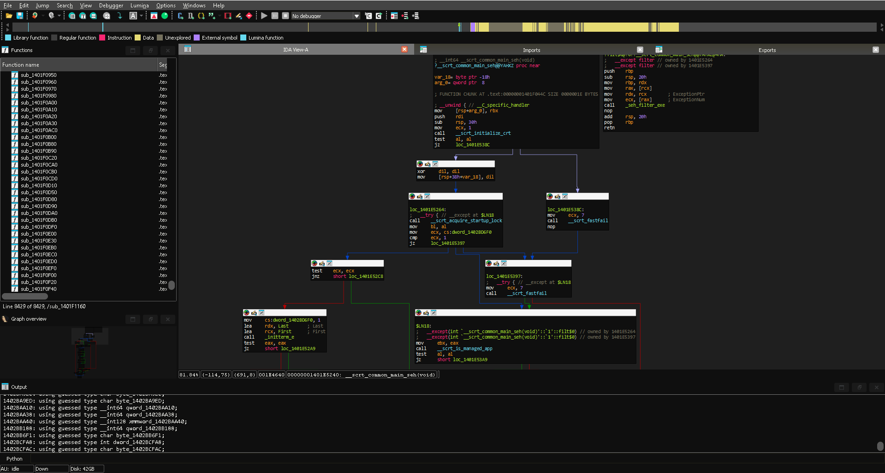

# IDA-Monokai-Theme
Monokai theme for IDA. 

Combined themes of Sublime Text's Monokai Dark theme and IDA's Dark theme.

WIP!!

  
  

# Installation

Download the monokai folder and put it in %APPDATA%\Hex-Rays\IDA Pro\themes, then select on the IDA Options the color monokai

Any suggestions are welcome!
